<div align=center>


</div>

<p align="center">
  
  
  
  
</p>

---
> ## Custom GitHub stats cards for your README. Real data. No auth required.

### 1. Profile Card

- Shows user info: avatar, name, bio, join date, repos, followers, and following.

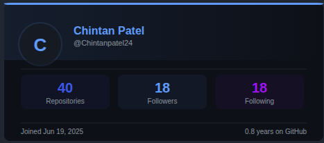

```html

```

---

### 2. Contribution Numbers

 I. GitHub-style contribution heatmap with daily commit counts.

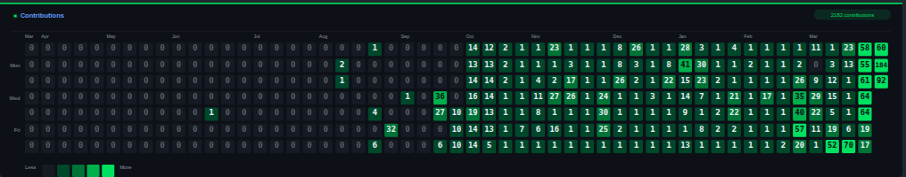

```html

```

 II. **Pulse** (monthly bars + 30-day trend):
 
 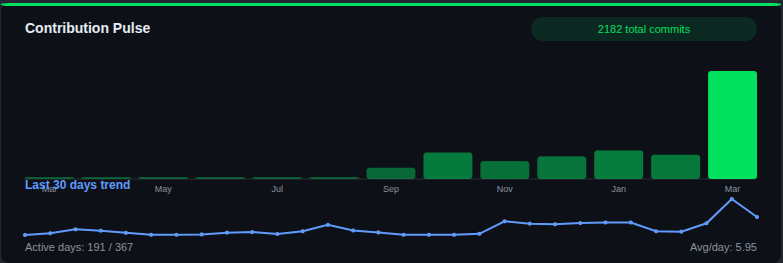
 
```html

```

---

### 3. Language Usage

 I. Horizontal stacked bar of languages with percentages using GitHub's official colors.

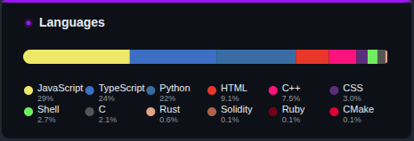

```html

```

 II. **Compact**:
 
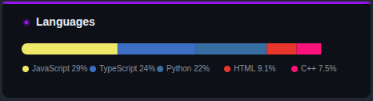

```html

```

 III. **Donut**:
 
 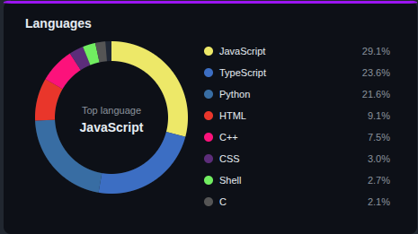

```html

```

---

### 4. Streak Card

I. Current and longest contribution streaks with fire visual and progress bar.

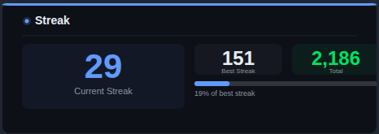

```html

```

II. **Compact** (total, current streak, longest streak):

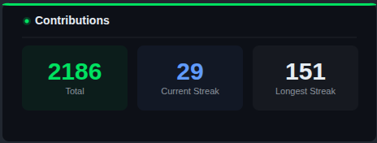

```html

```
---

### 5. Commits Ranking

 I. PR-style ranked list of days from highest to lowest commit count, with large green square markers and count bars.

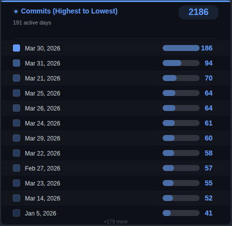

```html

```

 II. **Custom width**:
 
```html

```

 III. **Compact** (best day, active days, daily average):

 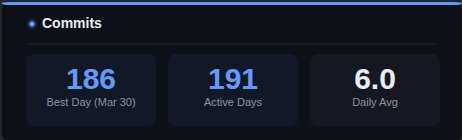


```html

```

---

### 6. Pull Request Stats 

 I. PR count with per-repository breakdown and progress bars.

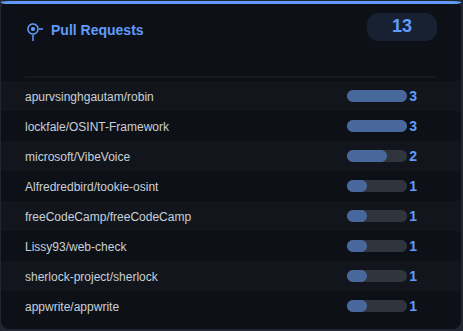

```html

```

 II. **Compact**:

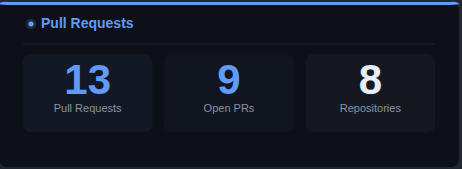

```html

```

---

### 7. Working Hours

- Calculates actual coding hours by analyzing commit timestamp gaps.

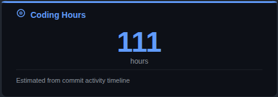

**Formula:** `TWt = Σ (Ti+1 - Ti) for all i where (Ti+1 - Ti) < 5 hours`

Where:
- `TWt` = Total Working Time
- `Σ` = Sum of all
- `Ti` = Timestamp of commit i
- `Ti+1` = Timestamp of next commit
- **Threshold:** Only counts gaps < 5 hours (assumes longer gaps are breaks/sleep)

```html

```

---

### 8. Overview Card

- Shows total stats: Stars, Last 12 Months Commits, PRs, Issues, Contributed to, Lines Changed.

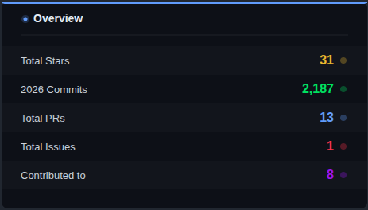

```html

```

Use `lines_scope=all` to calculate lines changed from all fetched PRs (slower):

```html

```

Use `lines_scope=recent` with `max_prs` (default: 30, max: 200) for faster calculation:

```html

```

---

## Quick Start

Copy any card URL and replace `YOUR_USERNAME` with your GitHub username:

```markdown
## My GitHub Stats


```

### Full README Example

```markdown
## GitHub Stats


```

---

## API Endpoints

| Endpoint | Description | Layouts | Refresh |
|----------|-------------|---------|---------|
| `/api/profile` | User profile info | - | 2 hours |
| `/api/contribution` | Contribution heatmap | `default`, `compact`, `pulse` | 30 min |
| `/api/languages` | Language distribution | `default`, `compact`, `donut` | 30 min |
| `/api/streak` | Streak stats | - | 30 min |
| `/api/commits` | Commits ranking | `default`, `compact` | 30 min |
| `/api/pr-stats` | Pull request stats | `default`, `compact` | 30 min |
| `/api/working-hours` | Estimated coding hours | - | 2 hours |
| `/api/overview` | Overall stats summary | - | 30 min |

---

## Parameters

All endpoints support these query parameters:

| Parameter | Description | Example |
|-----------|-------------|---------|
| `username` | GitHub username (required) | `torvalds` |
| `theme` | Color theme | `dark`, `synthwave`, `radical` |
| `hide_border` | Remove card border | `true` |
| `layout` | Card layout variant | `compact`, `pulse`, `donut` |
| `bg_color` | Background color (hex) | `010409` |
| `title_color` | Title color (hex) | `58a6ff` |
| `text_color` | Text color (hex) | `e6edf3` |
| `border_color` | Border color (hex) | `30363d` |
| `width` | Card width (supported by profile, PR stats, commits) | `520` |
| `max_langs` | Max languages shown | `15` |
| `lines_scope` | Overview lines-changed source (`recent` or `all`) | `recent` |
| `max_prs` | PR limit for overview when `lines_scope=recent` (1-200, default 30) | `50` |
| `refresh` | Force data refresh | `true` |

---

## Themes

Add `&theme=NAME` to any card URL:

| Theme | Preview Accent |
|-------|---------------|
| `dark` | Blue |
| `synthwave` | Pink |
| `radical` | Hot Pink |
| `tokyonight` | Blue |
| `dracula` | Purple |
| `gruvbox` | Yellow |
| `monokai` | Green |
| `nord` | Cyan |
| `solarized_dark` | Teal |
| `catppuccin` | Lavender |
| `github_dark` | Green |
| `highcontrast` | Yellow |

```html

```

---

## Custom Colors

Override any color with hex values (without `#`):

```
&bg_color=010409&title_color=58a6ff&text_color=e6edf3&border_color=30363d
```

---

## Auto-Refresh

Cards automatically update based on data type:

| Data | Cache Duration |
|------|---------------|
| Contributions, PRs, Languages, Commits, Streak, Overview | 30 minutes |
| Profile, Working Hours | 2 hours |

Data is cached server-side. CDN caches the response. Stale content is served while refreshing in the background.

### Force Refresh

Add `&refresh=true` to any URL to bypass the cache:

```
https://gitlyy.vercel.app/api/profile?username=YOUR_USERNAME&refresh=true
```

---

## How It Works

1. No authentication required - uses public GitHub API
2. Each user's data is cached separately
3. Auto-refreshes when cache expires
4. Works for any public GitHub profile
5. Zero dependencies - pure Node.js

---

## Self-Host

1. Fork this repo
2. Import at [vercel.com](https://vercel.com) (free tier)
3. Click Deploy

---

## Star History

<a href="https://www.star-history.com/?repos=Chintanpatel24%2Fgitlyy&type=date&legend=top-left">
 <picture>
   <source media="(prefers-color-scheme: dark)" srcset="https://api.star-history.com/chart?repos=Chintanpatel24/gitlyy&type=date&theme=dark&legend=top-left" />
   <source media="(prefers-color-scheme: light)" srcset="https://api.star-history.com/chart?repos=Chintanpatel24/gitlyy&type=date&legend=top-left" />
   
 </picture>
</a>
