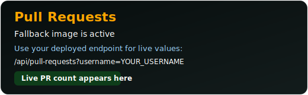
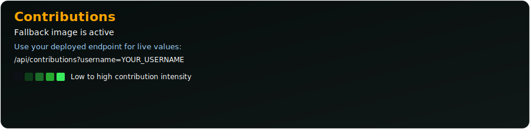

# GitHub Readme Cards

Minimal custom GitHub README cards with two endpoints:

- Pull Requests card
- Contributions card

No GitHub token is required for basic usage.

## Endpoints

- /api/pull-requests
- /api/contributions

## Quick Usage

Replace these values:

- YOUR_DEPLOYMENT_DOMAIN (example: my-cards.vercel.app)
- YOUR_USERNAME

```md


```

## Fallback Images (Always Work)

If dynamic cards fail on GitHub, use these static fallback images from this repository:

```md


```

You can keep both in README: show fallback first, then dynamic card below.

## Pull Requests Card

```md
https://YOUR_DEPLOYMENT_DOMAIN/api/pull-requests?username=YOUR_USERNAME
```

Parameters:

- username (required)
- theme
- title_color
- text_color
- bg_color
- border_color
- card_width
- hide_border
- border_radius
- custom_title
- disable_animations
- cache_seconds

## Contributions Card

```md
https://YOUR_DEPLOYMENT_DOMAIN/api/contributions?username=YOUR_USERNAME
```

Parameters:

- username (required)
- theme
- title_color
- text_color
- bg_color
- border_color
- card_width
- hide_border
- border_radius
- custom_title
- disable_animations
- cache_seconds

## Run Locally

```bash
npm install
npm run dev
```

Then open:

- http://127.0.0.1:9000/api/pull-requests?username=octocat
- http://127.0.0.1:9000/api/contributions?username=octocat

## Deploy

Deploy this repo to any Node.js host (Vercel, Railway, Render, etc.).

Important:

- Do not keep `your-deployment.vercel.app` in README.
- Use your real deployed domain.
- The image URL must be publicly accessible over HTTPS.

